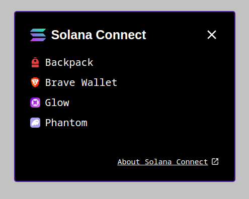

# solana-connect
Standalone wallet UI for Solana dApps



---

### Usage:
```
npm install solana-connect
```

```typescript
import { SolanaConnect } from "solana-connect";

const solConnect = new SolanaConnect();

solConnect.openMenu();

solConnect.onWalletChange((adapter) =>
  adapter
    ? console.log("connected:", adapter.name, adapter.publicKey.toString())
    : console.log("disconnected")
);

solConnect.onVisibilityChange((isOpen) => {
  console.log("menu visible:", isOpen);
});
```
